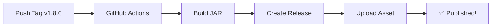

# 📦 Release Guide — EverTerra-TPA

This document describes how to publish a new version of EverTerra-TPA.

---

## 🔖 Version Numbering

We follow [Semantic Versioning](https://semver.org/):

```
v<MAJOR>.<MINOR>.<PATCH>
```

| Bump | When |
|------|------|
| **Major** (x.0.0) | Breaking API changes, major rewrites |
| **Minor** (0.x.0) | New features, non-breaking |
| **Patch** (0.0.x) | Bug fixes, small improvements |

---

## 🚀 How to Release

### Step 1: Update Version

Edit `build.gradle`:
```gradle
version = '1.8.0'
```

### Step 2: Commit

```bash
git add build.gradle
git commit -m "chore: bump version to 1.8.0"
```

### Step 3: Create Tag

```bash
git tag -a v1.8.0 -m "Release v1.8.0"
git push origin master --tags
```

### Step 4: Wait for GitHub Actions

Pushing a `v*.*.*` tag triggers `.github/workflows/release.yml`:

1. ✅ Build with JDK 21
2. ✅ Run `./gradlew build`
3. ✅ Create GitHub Release
4. ✅ Upload JAR as Release Asset

**No manual steps needed after push!**

---

## 🔄 Release Workflow



---

## 🏷️ Tag Examples

```bash
# Feature release
git tag -a v1.8.0 -m "feat: add PlaceholderAPI support"

# Bug fix
git tag -a v1.7.1 -m "fix: NPE on player quit during countdown"

# Major release
git tag -a v2.0.0 -m "feat!: rewrite storage layer with MySQL support"
```

---

## 📝 Release Notes

Release notes are auto-generated in `.github/workflows/release.yml`.

To customize notes for a specific release:

1. Go to GitHub Releases page
2. Click "Edit" on the release
3. Update the description
4. Click "Update release"

### Recommended Format

```markdown
## 🚀 EverTerra-TPA v1.8.0

### ✨ New Features
- Added PlaceholderAPI expansion support
- New `/tpa stats` command

### 🐛 Bug Fixes
- Fixed NPE when target goes offline during countdown
- Fixed Bedrock GUI not closing after accept

### 📦 Installation
1. Download EverTerra-TPA-1.8.0.jar
2. Place in plugins/ folder
3. Restart server
```

---

## ⏪ How to Rollback

### Rollback a Release

```bash
# 1. Delete the GitHub Release (via GitHub UI)
# 2. Delete the local and remote tag
git tag -d v1.8.0
git push origin :refs/tags/v1.8.0

# 3. Revert the version change
git revert <commit-hash>
git push origin master
```

### Rollback a Deployment

Simply replace the JAR in `plugins/` with the previous version and restart.

---

## 🤖 CI/CD Pipeline

| Workflow | Trigger | Action |
|----------|---------|--------|
| `build.yml` | Push to `master` / PR to `master` | Build + Upload Artifact |
| `release.yml` | Push tag `v*.*.*` | Build + Create Release + Upload Asset |

---

## 🔧 Manual Build (if CI fails)

```bash
# Set up proxy if needed
export GRADLE_OPTS="-Dhttp.proxyHost=127.0.0.1 -Dhttp.proxyPort=7890"

# Build
./gradlew build --no-daemon

# Output
ls -lh build/libs/EverTerra-TPA-*.jar
```

---

## ✅ Pre-Release Checklist

- [ ] All tests pass (`./gradlew build`)
- [ ] Version in `build.gradle` matches tag
- [ ] `README.md` updated if needed
- [ ] `CHANGELOG.md` updated (if exists)
- [ ] No breaking changes without MAJOR version bump
- [ ] Commit messages follow Conventional Commits
